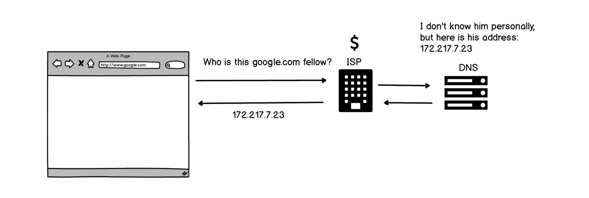
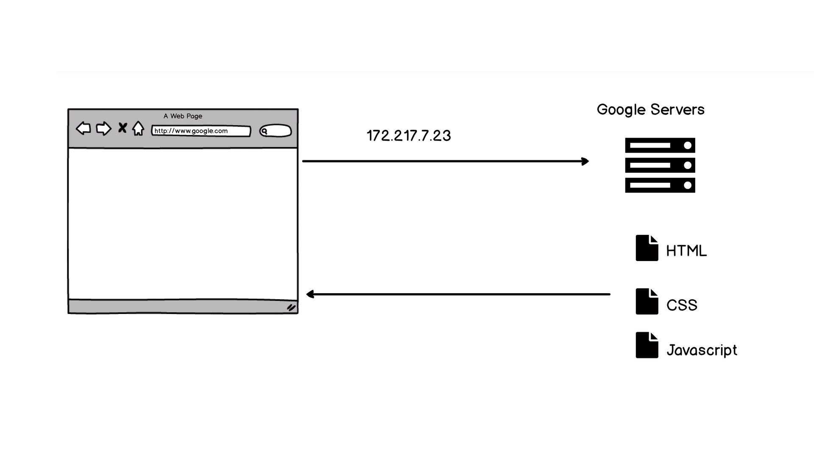
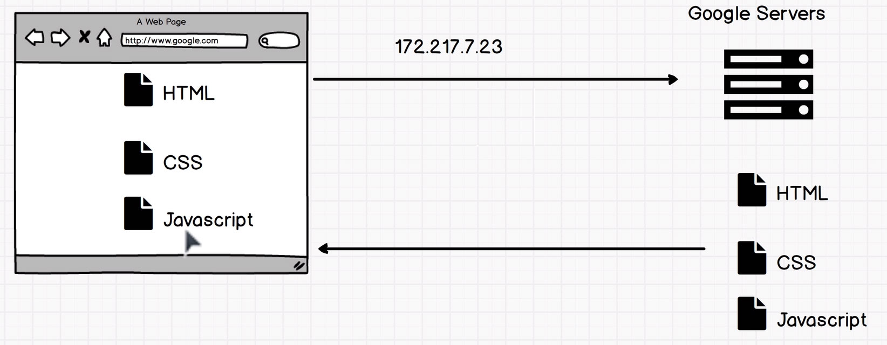
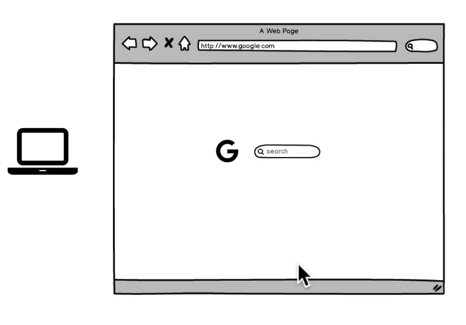

# How The Internet Works

 

## Browsing The Web

Temos aqui um laptop e nosso navegador, por exemplo o Google Chrome, digitamos google.com, mas bem, o que
acontece tecnicamente quando fazemos isso?

Quando entramos no Google.com e apertarmos o enter no nosso teclado, nós fazemos uma pergunta quem é este Google.com?

E essa pergunta é feita todo o caminho até o nosso ISP.

ISP é o provedor de serviços de Internet e foi colocado um cifrão na imagem apenas para saber
que são as pessoas que você paga para poder ter internet.
Aqui no Brasil digamos pode ser Vivo, Net Claro, Oi, Copel entre outros, porém isso depende do país ou cidade onde reside. A grandes empresas que ganham muito dinheiro com o uso da internet. Então eles recebem essa solicitação e a enviam para algo chamado servidor DNS, que é o Domain Name System ou em português Nome de Domínio dos Servidores, que será explicado mais a fundo a frente.

Essencialmente é uma lista telefônica - uma agenda telefônica com a lista de todos esses URL's, como o google.com, essa lista devolve esse pedido de volta para o ISP que envia para o navegador (Google Chrome) uma sequencia de números chamado de endereço IP que é um identificador. Qualquer coisa conectada à internet tem seu próprio endereço, exemplo o computador, o laptop, o celular, a impressora, todos eles possuem um endereço IP. Portanto, esse endereço IP permite que a internet funcione, pois através de um endereço sua localização é conhecida. 

 

 

Então, com o endereço identificado o navegador envia outra solicitação aos servidores que essencialmente são computadores que possuem um programa que executa pedidos, assim como um restaurante onde um garçom lhe traz comida para você. 

 

 

Esses servidores sabem através do IP como enviar arquivos quando você solicita por eles, assim exemplificando eles enviam arquivos HTML, CSS e JavaScript que serão explicados mais adiante. 

 

 

Esses arquivos são recebidos pelo navegador que os interpreta e finalmente nos mostra o conteúdo na tela. Tudo muito rápido, porém por baixo do capo tudo isso acontece. O endereço IP é enviado para os servidores do Google os servidores do Google nos enviam alguns arquivos para que possamos finalmente carregar o Google.com.

 

 
